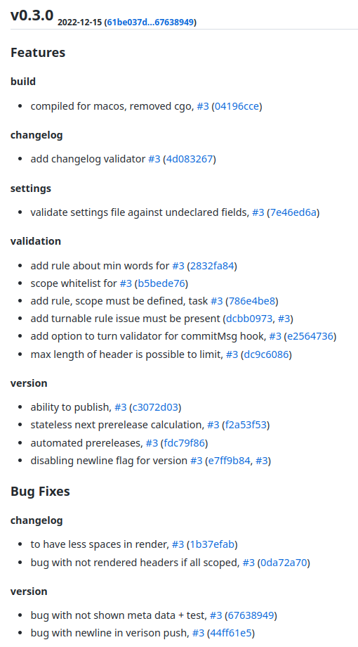

# Autogit

## Requirements

- [Head First Git](https://www.amazon.com/Head-First-Git-Learners-Understanding/dp/1492092517)
- [Learning GIT CLI intectively](https://learngitbranching.js.org/)
- [Learning advanced Git](https://git-scm.com/book/en/v2)
## Вступление

Для того чтобы пользоваться Гитом на хорошем уровне, нужно понять не так уж много [лучших практиках](https://deepsource.io/blog/git-best-practices/
) к нему. Но как вести красивые чейнджлоги, и с какой версией должны выпускать следующую версию продукта? Как не забыть слинковать номер Github/Gitlab issue к коммиту?

Ответом на эти вопросы послужили следующими стандарты:

### Git Conventional Commits

[Git Conventional Commits v1.0.0](https://www.conventionalcommits.org/en/v1.0.0/) стандартизирует написание коммитов к форме
```
<type>(<optional scope>): <subject>
empty separator line
<optional body>
empty separator line
<optional footer>
```

Каждый из коммитов имеет определенный тип:

- feat - для новых фич
- fix - для фикса багов
- refactor - для изменения структуры кода без введения нового поведения
- perf - для улучшение производиетльности
- style - для форматирования кода, добавки или удаления пробелов и тд
- test - для добавления или исправления тестов
- docs - для документации
- build - для сборке проекта

Мы можем также указать scope к примеру api - 'feat(api): new thing', для того чтобы указать на какую часть проекта данный коммит влияет.
Мы можем написать детальное более подробное описание что данные коммит делает.

Особый их смысл в том что на основе таких коммитов можно делать [инструменты](https://www.conventionalcommits.org/en/about/) генерирующие логи и добавляющие иной функционал на основе коммитов в такм формате! В том числе такой инструмент, который приведен дальше в статье.

Но как следовать всем этим стандартам? Для этого нужен инструмент автоматизирующий это через [Git Hooks](https://git-scm.com/book/en/v2/Customizing-Git-Git-Hooks)!

### Semantic Versioning

Помимо этого, когда мы выпускаем продукт для иных пользователей и разработчиков, мы должны указывать новую версию продукта при новых итерациях разработки.
Стандартом в этом плане считаются семантические версии вида `1.2.3`

- Если продукт исправить лишь баги, он повышает лишь PATCH версию, следующая версия - `1.2.4`
- Если добавлены новые фичи с обратной совместимостью (backward compatbility), то повышается MINOR версия, следующая версия `1.3.3`
- Если добавлены обратно не совместимые изменения, ломающие предыдущий интерфейс взаимодействия с иными пользователями и разработчиками, тогда увеличеваеться MAJOR версия, 2.2.3.

Можно спросить, а не часто ли тогда будет увеличеваться MAJOR версия? Да, может быть часто. Стандарт тонко намекает что надо аккуратнее с этим быть и подготавливать пользователей через deprecated обьявления и вводя все ломающие интерфейс изменения по реже. Впрочем во время первичной разработки пока версии 0.x.x, можно вносить ломающих изменений сколько угодно и они не будут повышать MAJOR версию. Во время первичной разработки никаких гарантий о то что следующая версия будет обратно совместимой, нету.

Помимо этого возможны alpha, beta, release candidate версии, что душе угодно через тире. `1.2.3-rc.1`
Хорошее определение этим prerelease версиям можно найти [здесь](https://www.quora.com/What-is-the-difference-between-alpha-beta-and-RC-software-version)

- Alpha версия - Первичное тестирование внутри организации произведено
- Beta версия - Бета тестирование, на ограниченном количестве пользователей продукт проверен (перекликается с канареечным деплоем)
- Release candidate - Финальная версия которую скорее всего опубликуют, после проведенных альфа и бета тестирований, с проведенными нагрузочными и иными тестированиями

Так же по стандарту можно добавить Build meta data не влияющую на версию никак кроме добавочной информации, например `1.2.3-rc.1+sha.c62f816`.
Можно добавить в Build данные версии, sha коммита, или время и таду. или все и сразу.

### Автоматизация

Стандарты это хорошо, но запомнить их и следовать им не так уж то и просто. Хорошо когда данный процесс можно автоматизировать. :) А ведь так хотелось еще и вести красивую историю коммитов и не забывать линковать к примеру Github / Gitlab номер задачи.

Вдохновленный [одним проектом на Node.js с той еще реализацией](https://github.com/qoomon/git-conventional-commits), но красивой идеей, я реализовал [схожий продукт но уже на Golang](https://github.com/darklab8/darklab_autogit) и новыми фичами. Главная цель была помимо прочего сделать продукт дружелюбным к CI pipeline использованию. а так же посмотрел иные решения и добавил функционал тех которые удобны сделать данный инструмент ультимативным решением в данной сфере

Итоговые следующие фичи продукта доступны:

- Валидация [git conventional commits](https://www.conventionalcommits.org/en/v1.0.0/) на pre-commit hook
- Валидация истории коммитов между релизами на `autogit changelog --validate`
- Высчитывания [Семантической версии следующего релиза](https://semver.org/spec/v2.0.0.html)
- Генерация [чейнджлогов](https://github.com/darklab8/darklab_autogit/releases/tag/v0.3.0-rc.2) с новыми фичами и исправленными багами к следующему релизу
- Когда создается таг через `autogit version --tag --other-flags`, туда автоматически летит чейнджлог
- CI дружелюбные бинаринки собранные под разные архитектуры Linux, Windows и MacOS. Безо всяких зависимостей устанавливать
- Даже Git встроен внутрь продукта и не требуется к установке. (Еще проще использовать в CI!)

Инструкцию по установке можно найти [здесь](https://github.com/darklab8/darklab_autogit#installation)

Как пользоваться?

- Установили.
- Покомитили в репозиторий
- Запросили следующую версию `autogit version` или чейнджлог изменений на `autogit changelog`
- Смотрите большее колво подробностей к командам в `autogit --help`, `autogit <cmd> --help`

### Логика программы

Для лучшего понимания логика программы задокументирована через [mermaid.js](https://mermaid.js.org/intro/). Ведь мы программируем не только для компьютеров, но и для других разработчиков и самих себя, когда будем читать свой код месяц спустя :)

#### Валидация коммитов и ченйджлогов

<!DOCTYPE html>

<html lang="en">
<head>
  <meta charset="utf-8">
</head>
<body>
  <div class="mermaid">
flowchart TD
  GitCommit[attempt to fixate commit like\ngit commit -m 'feat: add rendering in markdown format'\nwith 'autogit hook activate' enabled]
  RequestValidatingChangelog[Request changelog with --validate flag] --> TryParsingCommitMessage
  GitCommit --> TryParsingCommitMessage[Try parsing commit message\nto git conventional commit\ntype \ scope \ subject \ body \ footers]
  TryParsingCommitMessage --> ReportFail[Reporting errors if unable]
  TryParsingCommitMessage --> ContinuingValidation[Continue Validation]
  ContinuingValidation --> CheckOptionalValidationRulesIfEnabled[Check options validation rules\nif they are enabled]
  CheckOptionalValidationRulesIfEnabled --> CommitTypeInAllowedList[Commit type is\nin allowed list]
  CommitTypeInAllowedList --> WhenAppliedRules
  CheckOptionalValidationRulesIfEnabled --> MinimumNWords[Minimum N words is present\nin commit subhect]
  MinimumNWords --> WhenAppliedRules
  CheckOptionalValidationRulesIfEnabled --> IssueIsLinked[Issue is linked to commit]
  IssueIsLinked --> WhenAppliedRules
  CheckOptionalValidationRulesIfEnabled --> CheckOtherEnabledRulesInSettings[Check other enabled\nrules in settings]
  CheckOtherEnabledRulesInSettings --> WhenAppliedRules
  CheckOptionalValidationRulesIfEnabled --> WhenAppliedRules[when applied rules]
  WhenAppliedRules --> IfCommit[if it was commit,\nthen fixate if passed rules,\nor cancel fixation]
  WhenAppliedRules --> IfChangelog[if it was changelog validation\nthen report no errors and exit code 0\nfor pipeline checks]
  </div>
 <script src="mermaid.min.js"></script>
 <script>mermaid.initialize({startOnLoad:true});
</script>
</body>
</html>

#### Рендер чейнджлога

<!DOCTYPE html>

<html lang="en">
<head>
  <meta charset="utf-8">
</head>
<body>
  <div class="mermaid">
flowchart TD
    RequestingChangelog[Requesting changelog]
    RequestingChangelog --> ChangelogFromLatestCommitToPreviousTagVersion
    ChangelogFromLatestCommitToPreviousTagVersion[Requesting changelog from previous\ntag to latest commit]
    RequestingChangelog --> ChangelogFromChosenTagToPreviousTag
    ChangelogFromChosenTagToPreviousTag[Requesting changelog from chosen tag\nversion to previous tag version]
    ChangelogFromLatestCommitToPreviousTagVersion --> GenerateChangelog
    GenerateChangelog[Start generating changelog]
    ParseCommits[Parse commit in necessary tag range]
    ChangelogFromChosenTagToPreviousTag --> GenerateChangelog
    GenerateChangelog --> ParseCommits
    ParseCommits --> SelectAllowedTypesForRender
    SelectAllowedTypesForRender[Filter conventional commit `types` like `feat` allowed for render]
    SelectAllowedTypesForRender --> SubgroupIntoConventionalCommitScopes
    SubgroupIntoConventionalCommitScopes[Sub group commits according to conventional commit `scope`]
    GenerateChangelog --> CalculateNextSemver
    CalculateNextSemver[Calculate Next Semantic Version]
    CalculateNextSemver --> SendChangelogToRender
    SubgroupIntoConventionalCommitScopes --> SendChangelogToRender
    SendChangelogToRender[Receive changelog for render]
    SendChangelogToRender --> RenderChangelogMarkdown
    SendChangelogToRender --> RenderChangelogRst
    SendChangelogToRender --> RenderChangelogHtml
    RenderChangelogMarkdown[Render in markdown\n--implemented--]
    RenderChangelogRst[Render in rst\n--not implemented--]
    RenderChangelogHtml[Render in html\n--not implemented--]
  </div>
 <script src="mermaid.min.js"></script>
 <script>mermaid.initialize({startOnLoad:true});
</script>
</body>
</html>

#### Высчитывание следующей семантической версии, с учетом наличия альфа-бета-rc релизов

<!DOCTYPE html>

<html lang="en">
<head>
  <meta charset="utf-8">
</head>
<body>
  <div class="mermaid">
flowchart TD
  RequestNextSemanticVersioning[Request next semantic versioning]
  RequestNextSemanticVersioning --> FindCommits[Find commits\nfrom HEAD^1 to previous stable semantic version like v0.3.0]
  FindCommits --> CalculateVersionChange[Calculate main version change\nChoose only ONE path]
  CalculateVersionChange --> MajorChange[if git conventional commits\nwith breaking changes\nlike feat! are present\nand it is not 0.*.* development mode\nor flag `--publish` is present,\nthen add MAJOR version\nand reset MINOR and PATCH to 0\nchange: +1.0.0]
  CalculateVersionChange -->MinorChange[If commits with `feat` type are present\nincrease MINOR version and reset PATCH version to zero\n change: *.+1.0,]
  CalculateVersionChange -->PatchChange[if only commits with `fix`\n are present\nthen change only PATCH\nchange: *.*.+1]
  MajorChange --> CalculatedMainVersion
  MinorChange --> CalculatedMainVersion
  PatchChange --> CalculatedMainVersion
  CalculatedMainVersion[Calculated main version]
  CalculatedMainVersion --> CalculatePrereleaseVersion[Calculate next prerelease version]
  CalculatePrereleaseVersion --> FindLatestPrerelease[Find latest alpha beta and rc versions\nwith scanning commits up to latest stable version\nExcept not counting latest commit\nChoose ONE, SEVERAL or ALL paths next:]
  FindLatestPrerelease --> AlphaFlag[if alpha flag is present\nincrease alpha version\nand mark for rendering]
  FindLatestPrerelease --> BetaFlag[if beta flag is present\nincrease beta version\nand mark for rendering]
  FindLatestPrerelease --> RcFlag[if rc-release candidate-\nflag is present\nincrease rc version\nand mark for rendering]
  AlphaFlag --> CombineIntoTotalPrereleaseVersion
  BetaFlag --> CombineIntoTotalPrereleaseVersion
  RcFlag --> CombineIntoTotalPrereleaseVersion
  CombineIntoTotalPrereleaseVersion[Combine into latest prerelease version]
  CalculatedMainVersion --> AddBuildMetaData[Add build meta data as +$BuildMetaData\nto the end of version]
  CombineIntoTotalPrereleaseVersion --> OutputFinalSemanticVersion
  AddBuildMetaData --> OutputFinalSemanticVersion[Render Final Semantic Version]
  </div>
 <script src="mermaid.min.js"></script>
 <script>mermaid.initialize({startOnLoad:true});
</script>
</body>
</html>

### Архитектура кода проекта

<!DOCTYPE html>

<html lang="en">
<head>
  <meta charset="utf-8">
</head>
<body>
  <div class="mermaid">
flowchart TD
  CLI[cli - CLI interface\nUses cobra-cli third party lib]
  CLI --> UI[User interface]
  UI --> Actions[Reusable actions\nwithout attachements to UI details]
  Actions --> SemanticGit[Semantic Git\nImplements main business logic of repository\nwith added logic of conventional commits\nAnd semantic versioning]
  Actions --> Changelog[Chagenlog\nHow to generate one]
  Actions --> Validator[Validator\nRules for optional validations]
  Changelog --> SemanticGit
  Validator --> SemanticGit
  SemanticGit --> SemVer[SemVer\nimplements original Semantic Version\naccording to SemVer2.0.0 standard\nImplemented in current repo]
  SemanticGit --> Git[Git\ngit wrapper to simple interface\nfor current repository logic\nimplemented in current repo]
  Git --> GitGo[Git-Go\nEngine under the hood for\nGit repository operations\nImplemented by third party]
  </div>
 <script src="mermaid.min.js"></script>
 <script>mermaid.initialize({startOnLoad:true});
</script>
</body>
</html>

### Использование в CI

Предоставлены примеры использования с Github Actions

- [Валидация чейнджлога](https://github.com/darklab8/darklab_autogit/blob/master/.github/workflows/changelog.yml)
- [Сборка проекта](https://github.com/darklab8/darklab_autogit/blob/master/.github/workflows/build.yml) через [Taskfile](https://github.com/darklab8/darklab_autogit/blob/f078c23f9c5c690033cd2d078074982afa5ee53a/Taskfile.yml#L24)
- [Автоматическое создание тага к проекту из CI](https://github.com/darklab8/darklab_autogit/blob/master/.github/workflows/autotag.yml)

### Результаты

Делаем коммиты с активированным `autogit hook activate`
и набираем `autogit hook --tag --push` и сохраняем `autogit changelog`

[Получаем красивый релиз продукта](https://github.com/darklab8/darklab_autogit/releases/tag/v0.3.0-rc.2). Минимум усилий, максимум результата :)



где надо в pipeline используем `autogit version` ([см. пример CI с автотагом](https://github.com/darklab8/darklab_autogit/blob/4a90905550caa59558390b537dc92b54d7c771ca/.github/workflows/autotag.yml#L31)) с флагами для более читаемых версий к релизам продукта, в том числе сборки докер изображений.

Каждая из команд инструмента задокументирова на `autogit <cmd> --help`!

### Контакты

По вопросам чувствуйте смело обращаться одним из следующих способов:

- через Дискорд [Darklab Discord server](https://discord.gg/aukHmTK82J)
- [через Github Issues для новых фич или исправления багов](https://github.com/darklab8/darklab_autogit/issues)
- Или по почте `dark.dreamflyer@gmail.com`

Да прибудет с вами документация к проектам без особых усилий!